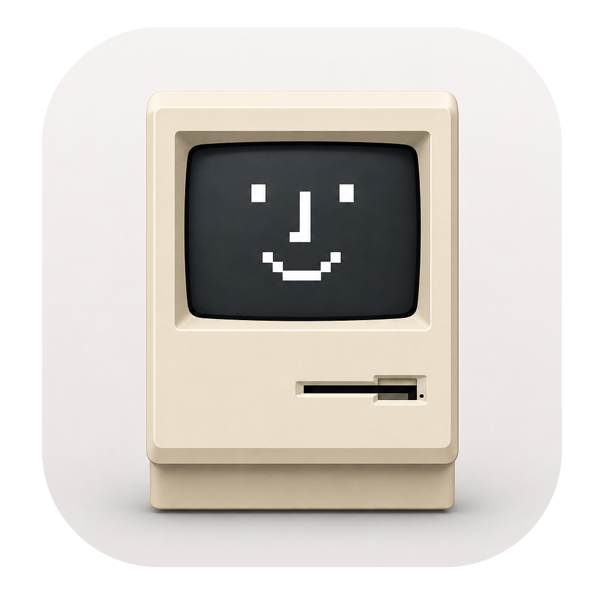
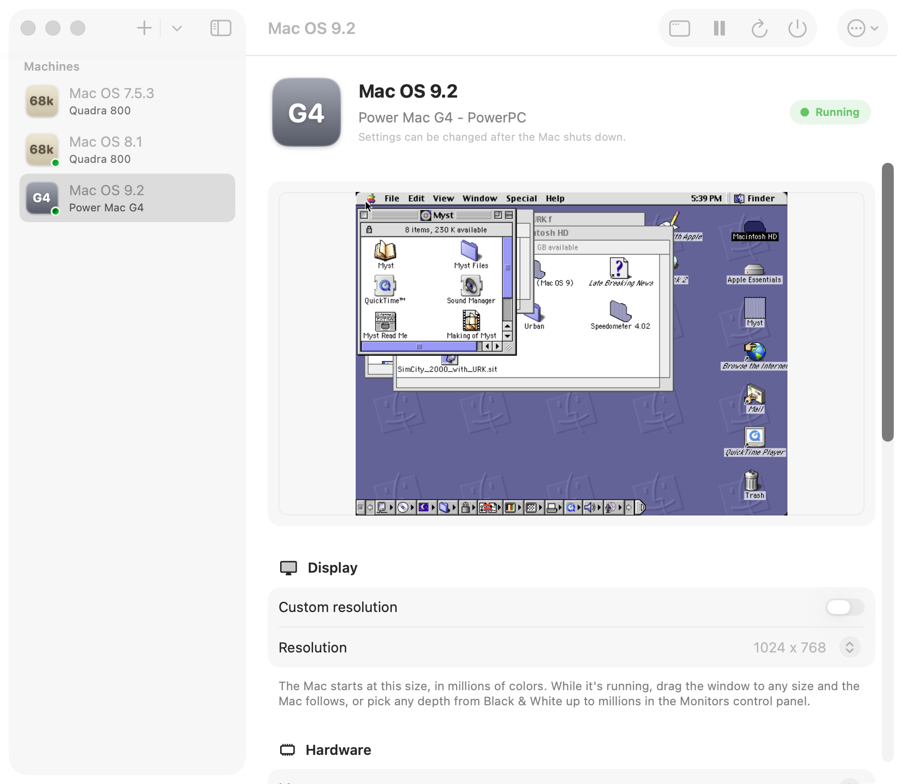
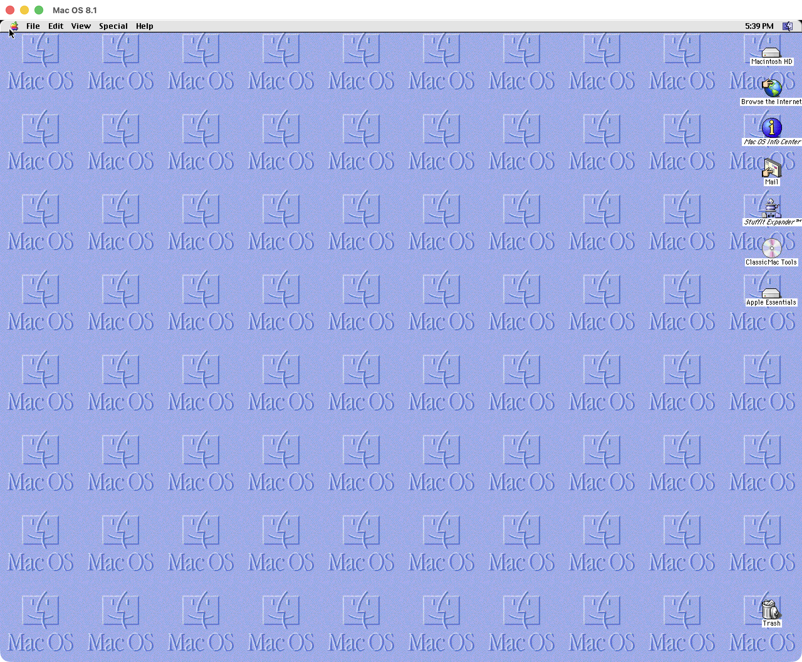
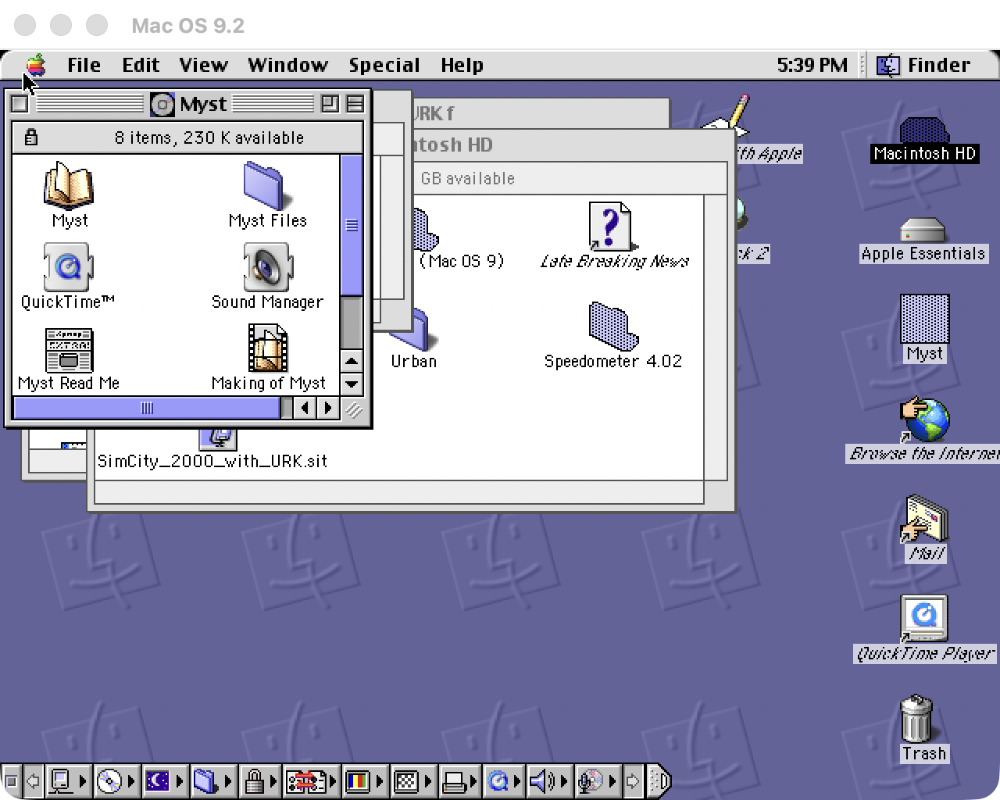

<p align="center">
  
</p>

<h1 align="center">ClassicMac</h1>

<p align="center">
  <strong>The whole classic Mac OS era, running natively fast on Apple Silicon.</strong><br>
  A self-contained macOS app that emulates a Motorola 68040 Quadra 800 and a PowerPC Power Mac G4<br>
  on a custom build of QEMU — no setup, no ROM hunting for Mac OS 9, no terminal.
</p>

<p align="center">
  
  
  
  
</p>

---

<p align="center">
  
</p>

<p align="center">
  
  
</p>

## What it is

ClassicMac wraps a custom QEMU build in a native SwiftUI app and covers the entire classic Mac OS era with two machines:

| Machine | CPU | Runs | Highlights |
| --- | --- | --- | --- |
| **Macintosh Quadra 800** | Motorola 68040 | System 7.1 – Mac OS 8.1 | Enhanced paravirtualized framebuffer (`nubus-qfb`), any resolution up to 3840x2160, all QuickDraw depths incl. Thousands |
| **Power Mac G4** | PowerPC (`mac99`) | Mac OS 8.5 – 9.2.2 | Boots through OpenBIOS — **no Apple ROM needed**, screamer (AWACS) sound, live window resizing via a custom `qemu_vga.ndrv` |

Everything is bundled into a single `ClassicMac.app`: the two QEMU system emulators, firmware, guest video drivers, folder-sharing drivers, and a guest-additions Tools CD. No Homebrew, no ROM files to track down for Mac OS 9, nothing to install inside the guest.

## Features

- **Drag the window, the Mac follows.** On both machines you can drag the QEMU window to any size and the guest switches to that exact pixel resolution when you release the mouse — the Display Manager does a real live resolution switch, no reboot. The Monitors control panel also offers the standard resolution list.
- **Enhanced video on the Quadra** (`-M q800,fb=qemu`): arbitrary resolutions up to 3840x2160, every QuickDraw depth including Thousands (16-bit), gamma correction, and multiple monitors — far beyond what stock QEMU's macfb can do.
- **Mac OS 9 without a ROM.** The Power Mac boots through OpenBIOS; a custom `qemu_vga.ndrv` is handed to Mac OS over fw_cfg at boot, so live resizing and millions of colors work with nothing installed in the guest.
- **Host folder sharing on both machines.** Pick a folder and it mounts on the emulated desktop as a read/write disk (classicvirtio + virtio-9p). Resource forks and type/creator codes round-trip via `.rdump`/`.idump` sidecars.
- **Clean, working sound.** The Quadra's Apple Sound Chip is patched to feed silence when idle (no more idle buzz), and the Power Mac gets the screamer (AWACS) device with a screamer-aware OpenBIOS.
- **Self-contained `.classic` machine documents.** Each VM is a single Finder package holding its config, disk, and PRAM. Keep it anywhere, double-click to boot, move it between Macs.
- **Classic input helpers.** Right-click opens contextual menus as Control+click, and the scroll wheel becomes arrow-key taps — both per-VM toggles for guests with real drivers (e.g. USB Overdrive).
- **A guest-additions Tools CD** (StuffIt Expander, Disk Copy, USB Overdrive, Transmit, Lido, patched HD SC Setup...) built from `guestcd/manifest.tsv`, insertable at runtime from the machine window's menu — everything pre-expanded and ready to run.
- **Native machine control.** Pause / Resume, Restart, and Power Off from the app via QEMU's monitor socket, live screen previews in the library, and a "Match Display" button that sizes the Mac to your screen.
- **Signed, notarized, stapled DMG** for distribution — recipients get a clean Gatekeeper experience even offline.

## Getting started

1. Grab **ClassicMac.dmg** from the [latest release](../../releases/latest), drag ClassicMac to Applications, and launch it.
2. Click **+** to create a machine — pick the Quadra 800 (System 7.1–8.1) or Power Mac G4 (Mac OS 8.5–9.2.2), choose disk size, RAM, and resolution.
3. Attach a Mac OS install CD image (ISOs are not bundled; bring your own), boot from it, and install.
4. Optional: pick a shared folder and it appears on the emulated desktop as a disk.

New machines are created as `.classic` documents (default `~/Documents/ClassicMac/`). Double-click one in Finder to boot it.

Requirements: an Apple Silicon Mac (M1 or later) running a recent macOS.

## Display & sound notes

- The resolution you pick is the *boot* resolution and the depth is the *deepest available* mode; classic Mac OS chooses the active depth at startup (a fresh system comes up in B&W until you pick Thousands/Millions once in Monitors — it's remembered per machine).
- Live resolution switching relies on the Display Manager, so it needs Mac OS ~7.6+ on the Quadra; on the Power Mac it works throughout Mac OS 9. Older systems still boot fine at the configured resolution and scale to the window. Power Mac widths snap down to a multiple of 8 (a VGA hardware constraint).
- The Power Mac's packed low-bpp patch adds Black & White, 4 and 16 colors to the Monitors panel alongside 256/thousands/millions.
- Mac OS 9 wants **less than 1 GB of RAM** for stable sound, so the app's presets stop at 896 MB.
- On the Quadra, folder sharing arrives through the classicvirtio NuBus declaration ROM (new machines start from a pre-seeded PRAM so it boots reliably). On the Power Mac it arrives through `virtio-9p-pci` and the classicvirtio ndrvloader placed in guest RAM at boot; while booting from CD (e.g. an OS install) sharing is temporarily inactive.

## Building from source

```bash
# 1. Build the emulator (clones mainline QEMU 11.0.2, applies the ClassicMac
#    patch set, compiles qemu-system-m68k + qemu-system-ppc)
./scripts/build-qemu.sh

# 2. Build the SwiftUI app and bundle QEMU + firmware + dylibs into
#    dist/ClassicMac.app (code-signed)
./scripts/bundle-qemu.sh

# 3. Optional: build the guest-additions Tools CD (cached downloads)
./scripts/build-guest-cd.sh

# 4. Optional: notarize and package a distributable disk image
./scripts/make-dmg.sh
```

All scripts are idempotent and safe to re-run. Building needs the Xcode command line tools and [Homebrew](https://brew.sh).

The guest-side binaries are committed, so a normal build needs no cross toolchain. If you change them, rebuild with:

```bash
# 68k declaration ROM + qfb driver (builds Retro68 into vendor/ on first run)
./scripts/build-qfb-rom.sh          # -> qfb/mac_qfb.rom

# PPC video driver (adds Retro68 PPC compilers + Universal Interfaces)
./scripts/build-ppcvid-ndrv.sh      # -> ppcvid/qemu_vga.ndrv
```

## Repository layout

```
ClassicMac/
  app/                      # SwiftUI configurator / launcher (SwiftPM package)
  Resources/                # app icon, machine icon, Quadra 800 ROM (checksum F1ACAD13)
  qfb/                      # nubus-qfb enhanced framebuffer device + 68k driver ROM
    driver/                 #   68k declaration ROM + driver source (Retro68)
  ppcvid/                   # PPC live-resize: VGA host-resize + packed-depth patches
    driver/                 #   qemu_vga.ndrv source (QemuMacDrivers fork, Retro68)
  screamer/                 # screamer (AWACS) PPC audio device + OpenBIOS
  shared/                   # classicvirtio declrom + ndrvloader + PRAM seed (folder sharing)
  cocoaui/                  # Cocoa display patches: menus, input helpers, media names
  audio/                    # CoreAudio backend patch
  guestcd/                  # Tools CD manifest + HFS copy tooling
  scripts/                  # build-qemu, bundle-qemu, build-guest-cd, make-dmg, notarize...
```

> The Quadra 800 ROM is committed so the app is turnkey, and the Power Mac needs no Apple ROM at all. Mac OS install ISOs are **not** committed; import your own through the app.

## How the interesting parts work

- **Quadra video** — `nubus-qfb`, a paravirtualized NuBus framebuffer (ported from [SolraBizna/qemu](https://github.com/SolraBizna/qemu) onto QEMU 11.0.2) with a 68k declaration ROM/driver built with Retro68. The Cocoa window scales the framebuffer while you drag and asks the guest driver for the exact size on mouse-up.
- **Power Mac video** — QEMU's std VGA gains a host-resize request channel (`ppcvid/vga-host-resize.patch`). The bundled `qemu_vga.ndrv` polls it from its VBL task, retargets a dynamic display mode, and fires a VSL connect-change interrupt so the Display Manager re-probes and adopts the new size.
- **Restart on the Power Mac** — an in-place reset hangs QEMU's `mac99`, so the app runs it with `-action reboot=shutdown`, watches the QMP shutdown reason, and relaunches on a reset — Restart behaves like a real reboot.
- **Sound** — the ASC is patched to output silence when idle (`qfb/asc-silence.patch`); the Power Mac uses Mark Cave-Ayland's screamer device with a screamer-aware OpenBIOS build.
- **Emulation speed** — both machines run on QEMU's TCG JIT; an Apple Silicon Mac runs them comfortably faster than the original hardware.

## Credits

- [QEMU](https://www.qemu.org/) and the m68k / q800 maintainers (incl. the `nubus-virtio-mmio` transport).
- [SolraBizna/qemu](https://github.com/SolraBizna/qemu) for the `nubus-qfb` paravirtualized framebuffer (ported here onto QEMU 11.0.2).
- [elliotnunn/classicvirtio](https://github.com/elliotnunn/classicvirtio) for the classic Mac OS virtio drivers used for folder sharing (68k declaration ROM and PowerPC ndrvloader), and for the Retro68 ndrv link recipe used to build the Power Mac video driver.
- [QemuMacDrivers](https://github.com/qemu/QemuMacDrivers) (Benjamin Herrenschmidt, Mark Cave-Ayland) for the `qemu_vga.ndrv` Power Mac video driver that `ppcvid/driver` extends with live host-window resizing.
- [mcayland/qemu](https://github.com/mcayland/qemu/tree/screamer) for the screamer (AWACS) PPC audio device and screamer-aware OpenBIOS (ported here onto QEMU 11.0.2).
- [Retro68](https://github.com/autc04/Retro68) for the 68k and PPC classic Mac OS cross toolchain.
