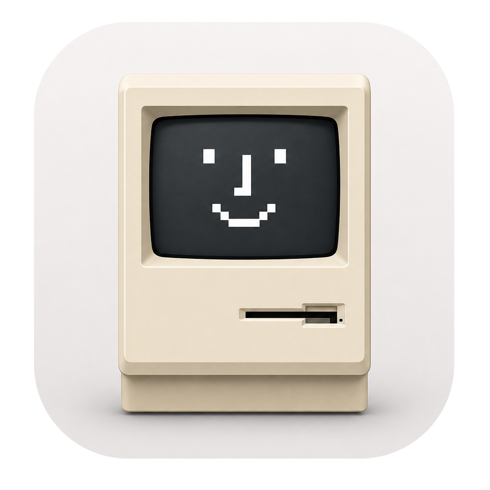
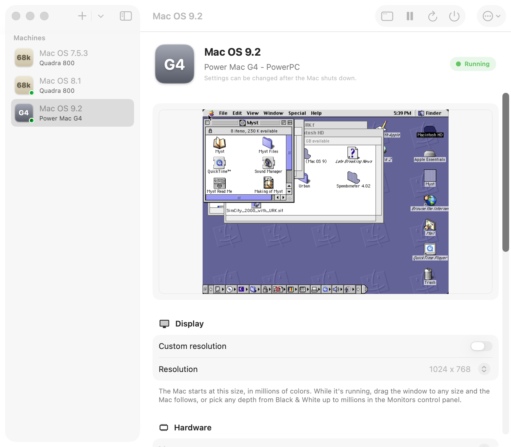
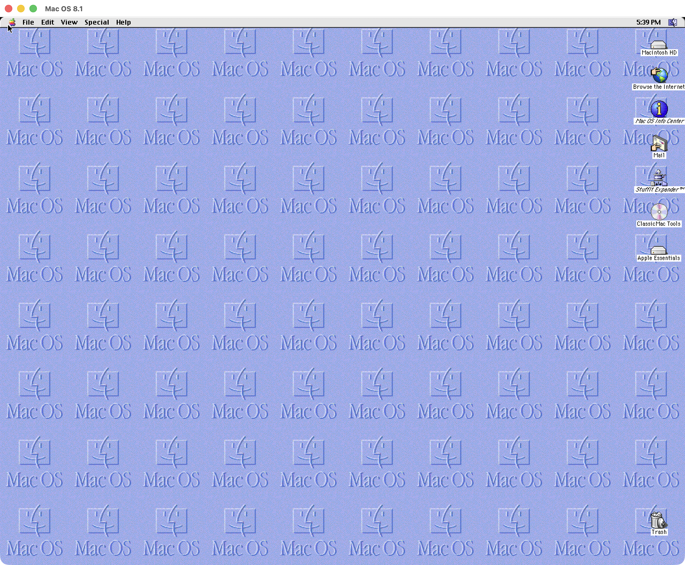
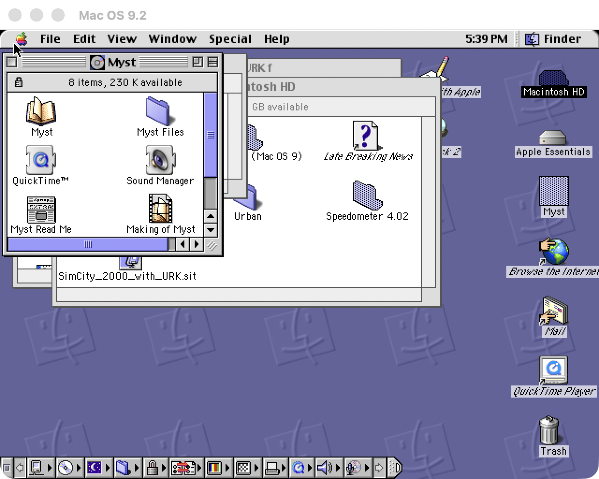

<p align="center">
  
</p>

<h1 align="center">ClassicMac</h1>

<p align="center">
  <strong>The whole classic Mac OS era, running natively fast on Apple Silicon.</strong><br>
  A self-contained macOS app that emulates a Motorola 68040 Quadra 800 and a PowerPC Power Mac G4<br>
  on a custom build of QEMU — no setup, no terminal, nothing to install inside the guest.
</p>

<p align="center">
  
  
  
  
</p>

---

<p align="center">
  
</p>

<p align="center">
  
  
</p>

## What it is

ClassicMac wraps a custom QEMU build in a native SwiftUI app and covers the entire classic Mac OS era with two machines:

| Machine | CPU | Runs | Highlights |
| --- | --- | --- | --- |
| **Macintosh Quadra 800** | Motorola 68040 | System 7.1 – Mac OS 8.1 | Enhanced paravirtualized framebuffer (`nubus-qfb`), writable removable floppy images, any resolution up to 3840x2160, all QuickDraw depths incl. Thousands |
| **Power Mac G4** | PowerPC (`mac99`) | Mac OS 8.5 – 9.2.2 | Boots through OpenBIOS firmware, screamer (AWACS) sound, browser-native display, custom `qemu_vga.ndrv` |

Everything is bundled into a single `ClassicMac.app`: the two QEMU system emulators, firmware, guest video drivers, folder-sharing drivers, and a guest-additions Tools CD. No Homebrew, nothing to hunt down, nothing to install inside the guest.

You bring your own Mac OS installation media: every classic Mac OS version is available in the [WinWorld operating system library](https://winworldpc.com/library/operating-systems), and ClassicMac imports the disc image with a couple of clicks. Mac OS 8.5, 8.6, 9.2.1, and the [Mac OS 9.2.2 Universal Install CD](https://macintoshgarden.org/apps/mac-os-922-universal) all boot reliably on the Power Mac — see the note in Getting started.

## Built on the shoulders of giants

ClassicMac exists because of years of brilliant work by other engineers. The patches and drivers that make it possible deserve top billing:

- [QEMU](https://www.qemu.org/) and the m68k / q800 maintainers (incl. the `nubus-virtio-mmio` transport) — the emulation core underneath everything.
- [SolraBizna/qemu](https://github.com/SolraBizna/qemu) for the `nubus-qfb` paravirtualized framebuffer (ported here onto QEMU 11.0.2) that gives the Quadra arbitrary resolutions and rich color.
- [elliotnunn/classicvirtio](https://github.com/elliotnunn/classicvirtio) for the classic Mac OS virtio drivers used for folder sharing and Quadra floppy images (68k card firmware and the PowerPC ndrvloader), and for the ndrv link recipe used to build the Power Mac video driver.
- [QemuMacDrivers](https://github.com/qemu/QemuMacDrivers) (Benjamin Herrenschmidt, Mark Cave-Ayland) for the `qemu_vga.ndrv` Power Mac video driver that `ppcvid/driver` extends with live host-window resizing.
- [mcayland/qemu](https://github.com/mcayland/qemu/tree/screamer) for the screamer (AWACS) PPC audio device and screamer-aware OpenBIOS (ported here onto QEMU 11.0.2).
- [Retro68](https://github.com/autc04/Retro68) for the 68k and PPC classic Mac OS cross toolchain.
- [noVNC](https://github.com/novnc/noVNC) for the browser-native VNC client used by the private local display page.

## Features

- **The Mac opens in your web browser.** Starting either machine launches a private loopback URL in your preferred browser instead of a separate emulator window. The app also shows the address so you can reopen or copy it, while Fit, Actual Size, Full Screen, modifier-key, and game-mouse controls stay close at hand.
- **Enhanced video on the Quadra** (`-M q800,fb=qemu`): arbitrary resolutions up to 3840x2160, every QuickDraw depth including Thousands (16-bit), gamma correction, and multiple monitors — far beyond what stock QEMU's macfb can do.
- **Zero guest setup on the Power Mac.** It boots through OpenBIOS firmware, and a custom `qemu_vga.ndrv` is handed to Mac OS over fw_cfg at boot, so live resizing and millions of colors work with nothing installed in the guest.
- **Host folder sharing on both machines.** Pick a folder and it mounts on the emulated desktop as a read/write disk (classicvirtio + virtio-9p). Resource forks and type/creator codes round-trip via `.rdump`/`.idump` sidecars.
- **Writable floppy images on the Quadra.** Attach a raw `.img`, `.dsk`, `.ima`, or `.raw` image in Media settings before startup and it appears as a writable classic Mac disk.
- **Clean, working sound.** The Quadra's Apple Sound Chip is patched to feed silence when idle (no more idle buzz), and the Power Mac gets the screamer (AWACS) device with a screamer-aware OpenBIOS.
- **Self-contained `.classic` machine documents.** Each VM is a single Finder package holding its config, disk, and PRAM. Keep it anywhere, double-click to boot, move it between Macs.
- **Classic input helpers.** Secondary click opens contextual menus as Control+click, and the scroll wheel becomes arrow-key taps. Turn both off in machine settings for guests with real drivers (e.g. USB Overdrive).
- **A guest-additions Tools volume** (StuffIt Expander, Disk Copy, USB Overdrive, Transmit, Lido, patched HD SC Setup...) built from `guestcd/manifest.tsv`. On Power Macs it mounts automatically at startup as a read-only Virtio disk, using the same guest-driver path as folder sharing instead of unreliable OS 9 IDE hot-plug. Everything is pre-expanded and ready to run.
- **Experimental GXMetal 3D acceleration on Mac OS 9.** The Tools CD carries a
  one-click installer for a PowerPC QuickDraw 3D RAVE engine. It batches guest
  drawing commands to the host, renders them with Metal, and safely leaves
  unsupported contexts to Apple's software renderer. The included GXMetal
  Test verifies the advertised RAVE contract and measures both engines before
  a game is launched. GXMetal AGL Probe separately verifies accelerated Apple
  OpenGL context creation, triangle and quad rendering, RGBA textures,
  source-alpha blending, depth ordering, readback, resource deletion, and
  teardown. Protocol 1.23 supports exact complex-region clipping, deep-Z
  contexts, public RGB24 and private RGBA uploads, and the ATI/OpenGL filled
  triangle, strip, fan, quad, quad-strip, polygon, and clipped-fan paths
  exercised by Cro-Mag Rally and Oni. The ATI compatibility layer synchronizes
  OpenGL alpha, blend, depth, fog, channel-mask, clear, and texture sampling
  state before those draws. A classic
  puzzle-piece M appears in the startup extension row when GXMetal's companion
  loads.
- **Native machine control.** Pause / Resume, Restart, and Shut Down from the app, live screen previews in the library, a visible browser URL, and a "Match Display" button that chooses a screen-sized boot resolution.
- **Safe, faster shutdown cycles.** The app's Shut Down command presses the
  virtual Mac's Power key and confirms Mac OS's own dialog, allowing HFS/HFS+
  to unmount cleanly so the next boot does not pay the recovery penalty.
- **Signed, notarized, stapled DMG** for distribution — recipients get a clean Gatekeeper experience even offline.

## Getting started

1. Grab **ClassicMac.dmg** from the [latest release](../../releases/latest), drag ClassicMac to Applications, and launch it.
2. Click **+** to create a machine — pick the Quadra 800 (System 7.1–8.1) or Power Mac G4 (Mac OS 8.5–9.2.2), choose disk size, RAM, and resolution.
3. Attach a Mac OS install CD image and boot from it. Installation media is not bundled — download the classic Mac OS version you want from the [WinWorld operating system library](https://winworldpc.com/library/operating-systems).
4. Optional: pick a shared folder, or attach a raw floppy image to a Quadra. Both appear on the emulated desktop as writable disks.
5. Click **Start**. ClassicMac opens the private display URL in your preferred browser; the same URL remains visible in the machine details if you close the tab.
6. To test GXMetal on Mac OS 9, open the automatically mounted **ClassicMac Tools** disk, then open **GXMetal**,
   run **Install GXMetal**, restart, and run **GXMetal Test**. Proceed to a RAVE
   game only after the test reports a pass; moving both GXMetal and GXMetal
   Startup out of Extensions and restarting restores the normal Apple software
   path.

> [!IMPORTANT]
> **Installing Mac OS 9?** Initialize the destination with Drive Setup from
> the CD first. In the Installer's final **Install Software** screen, open
> **Options…** and turn off **Update Apple Hard Disk Drivers**, then perform a
> regular installation. ClassicMac's QEMU build fixes the MacIO IDE/DBDMA
> completion race that made some 9.2.1 and 9.2.2 installers freeze around
> "About 4 minutes remaining," so a frozen partial System Folder is no longer
> expected or considered a successful install. During a Power Mac CD boot,
> ClassicMac leaves the Tools tray empty so the selected startup disc boots
> cleanly. Tools stays deferred for that installer boot; after installation,
> shut down, turn off **Start from disc**, and start the Power Mac normally.
> The read-only **ClassicMac Tools** volume then mounts automatically.

New machines are created as `.classic` documents (default `~/Documents/ClassicMac/`). Double-click one in Finder to boot it.

Requirements: an Apple Silicon Mac (M1 or later) running a recent macOS.

## Display & sound notes

- The resolution you pick is the *boot* resolution and the depth is the *deepest available* mode; classic Mac OS chooses the active depth at startup (a fresh system comes up in B&W until you pick Thousands/Millions once in Monitors — it's remembered per machine).
- The browser's **Fit** mode prefers the largest whole-number scale that fits the tab and uses sharp nearest-neighbor edges when it must shrink the image. Choose **Actual Size** for one guest pixel per browser pixel, and use the page's **Fullscreen** button to enter or leave browser fullscreen.
- The browser toolbar provides sticky Command, Option, and Control modifiers plus a dedicated Escape button, which makes host-reserved key combinations practical. Games using GXMetal Input automatically reveal a **Capture game mouse** control for relative movement; press Escape to leave pointer lock.
- Power Mac widths snap down to a multiple of 8 (a VGA hardware constraint).
- The Power Mac's packed low-bpp patch adds Black & White, 4 and 16 colors to the Monitors panel alongside 256/thousands/millions.
- Mac OS 9 wants **less than 1 GB of RAM** for stable sound, so the app's presets stop at 896 MB.
- On the Quadra, folder sharing arrives through the classicvirtio NuBus card firmware (new machines start from a pre-seeded PRAM so it boots reliably). On the Power Mac it arrives through `virtio-9p-pci` and the classicvirtio ndrvloader placed in guest RAM at boot; while booting from CD (e.g. an OS install) sharing is temporarily inactive.

## Building from source

```bash
# 1. Build the emulator (clones mainline QEMU 11.0.2, applies the ClassicMac
#    patch set, compiles qemu-system-m68k + qemu-system-ppc)
./scripts/build-qemu.sh

# 2. Build the guest-additions Tools CD (cached downloads). This must precede
#    app bundling so the exact GXMetal driver and installer enter the release.
./scripts/build-guest-cd.sh

# 3. Build the SwiftUI app and bundle QEMU + firmware + dylibs into
#    dist/ClassicMac.app (code-signed)
./scripts/bundle-qemu.sh

# 4. Notarize and package a distributable disk image
./scripts/make-dmg.sh

# 5. Verify the exact signed/stapled artifact, including versions, Gatekeeper,
#    the bundled Tools CD, and the GXMetal-enabled Power Mac executable
./scripts/verify-release.sh dist/ClassicMac.dmg 2.1.3 2.1.3
```

All scripts are idempotent and safe to re-run. Building needs the Xcode command line tools and [Homebrew](https://brew.sh).

The guest-side binaries are committed, so a normal build needs no cross toolchain. If you change them, rebuild with:

```bash
# 68k qfb card firmware + driver (builds Retro68 into vendor/ on first run)
./scripts/build-qfb-rom.sh          # -> qfb/mac_qfb.rom

# PPC video driver (adds Retro68 PPC compilers + Universal Interfaces)
./scripts/build-ppcvid-ndrv.sh      # -> ppcvid/qemu_vga.ndrv

# Classicvirtio Quadra card firmware and Power Mac NDRV loader
./scripts/build-classicvirtio-floppy.sh  # -> shared/declrom + shared/ndrvloader

# Power Mac OpenBIOS firmware (uses the OpenBIOS Linux builder container)
./scripts/build-openbios.sh               # -> screamer/openbios-ppc
```

## Repository layout

```
ClassicMac/
  app/                      # SwiftUI configurator / launcher (SwiftPM package)
  browser/                  # branded loopback-only noVNC display client
  Resources/                # app icon, machine icon, bundled firmware
  qfb/                      # nubus-qfb enhanced framebuffer device + 68k driver
    driver/                 #   68k card firmware + driver source (Retro68)
  ppcvid/                   # PPC live-resize: VGA host-resize + packed-depth patches
    driver/                 #   qemu_vga.ndrv source (QemuMacDrivers fork, Retro68)
  classicvirtio/            # removable floppy + Power Mac startup-driver patches
  powermac/                 # QEMU and OpenBIOS Mac OS 8 compatibility patches
  virtio/                   # QEMU removable VirtIO block device patch
  screamer/                 # screamer (AWACS) PPC audio device + OpenBIOS
  shared/                   # classicvirtio card firmware + ndrvloader + PRAM seed
  cocoaui/                  # Cocoa display patches: menus, input helpers, media names
  audio/                    # CoreAudio backend patch
  ide/                      # PPC MacIO IDE/DBDMA timing fix + tracepoints
  guestcd/                  # Tools CD manifest + HFS copy tooling
  scripts/                  # build-qemu, bundle-qemu, build-guest-cd, make-dmg, notarize...
```

> Mac OS installation media is **not** committed; download the version you want from the [WinWorld operating system library](https://winworldpc.com/library/operating-systems) (Mac OS 8.5, 8.6, 9.2.1, and the [9.2.2 Universal Install CD](https://macintoshgarden.org/apps/mac-os-922-universal) are supported) and import it through the app.

## How the interesting parts work

- **Browser display** — each running VM gets an HTTP server and QEMU VNC WebSocket bound only to `127.0.0.1`. The bundled noVNC client renders the framebuffer, sends keyboard and pointer input, scales it to the tab, reconnects across Power Mac restarts, and understands QEMU's relative-pointer extension for games.
- **Quadra video** — `nubus-qfb`, a paravirtualized NuBus framebuffer (ported from [SolraBizna/qemu](https://github.com/SolraBizna/qemu) onto QEMU 11.0.2) with 68k card firmware and a driver built with Retro68.
- **Power Mac video** — QEMU's std VGA gains packed low-color and optimized framebuffer paths. The bundled `qemu_vga.ndrv` supplies the full classic Mac display-mode set without a guest installation.
- **Restart on the Power Mac** — an in-place reset hangs QEMU's `mac99`, so the app runs it with `-action reboot=shutdown`, watches the QMP shutdown reason, and relaunches on a reset — Restart behaves like a real reboot.
- **Sound** — the ASC is patched to output silence when idle (`qfb/asc-silence.patch`); the Power Mac uses Mark Cave-Ayland's screamer device with a screamer-aware OpenBIOS build.
- **Power Mac storage** — MacIO IDE/DBDMA holds the final DMA descriptor for 1 ms before publishing completion. Real hardware cannot finish in the same scheduling window in which the driver starts an operation; without this small latency, cached host I/O can beat Mac OS 9's synchronous-wait setup and lose its wakeup, freezing Installer mid-copy. Focused MacIO/DBDMA tracepoints remain available for regression runs.
- **Mac OS 9 hard-disk startup** — hard-disk boots use a startup-only accounted instruction clock, zero-delay cached IDE completion, and PowerPC TCG fast paths so Mac OS 9's hardware and timebase polling does not sleep on the host. QEMU recognizes Finder's menu bar directly in guest VRAM—even headless and at arbitrary supported resolutions—then atomically returns the virtual clock and 25 MHz PowerPC timebase to real time before applications run. A 15-second app fallback covers unusual themes; installer-CD boots retain normal timing and the 1 ms IDE race safeguard. Six 512 MB cold boots of the 1920×1080 OS 9.2.2 test machine reached the automatic handoff in 9.92–10.22 seconds, including a reboot after verified clean shutdown, versus roughly 18.5 seconds on the former real-time-only path; exact results vary with host load and guest configuration.
- **Power Mac Mac OS 8 startup** — the machine uses a CUDA/G3 profile with an original-iMac OpenBIOS identity and classic Mac NVRAM/RTAS services. During CD startup, a read-only Virtio mirror lets the Mac OS 8.5/8.6 ROM read the selected disc before its IDE driver is active; the ordinary IDE CD stays present for Installer and Finder.
- **Quadra floppy storage** — a removable `virtio-blk-device` rides on the existing classicvirtio NuBus transport. A small extension to the 68k block driver adds writes, flushes, media-change events, and a host/guest eject handshake so Finder owns the unmount before QEMU removes the raw image.
- **Emulation speed** — both machines run on QEMU's TCG JIT; an Apple Silicon Mac runs them comfortably faster than the original hardware.
